 

  

## 🍬 关于我

> 一个喜欢把想法又快又好玩地做出来的开发者 ☕
> 主要折腾 **AI 应用**、**Agent 技能** 和 **小游戏**，也爱写点让日常更省事的小工具。

- 🎙️ **语音 & AI 应用** — 做过 MiMo TTS 音色工坊、GPT-SoVITS 本地语音工作台，音频与语料不出本机
- 🛠️ **Agent Skill 工匠** — 写过综测计分、论文格式化、磁盘清理、聊天记录分析等一系列可复用技能
- 🎮 **游戏开发** — 用 Godot / GDScript 参加 GGJ 2026，做过完整的小游戏原型
- 📱 **移动端** — Kotlin 写过 Android 插件，喜欢折腾逆向与抓包小工具
- 🎨 **可视化 & 前端** — ECharts Markdown 阅读器、AI 生图科普站
- 🎧 **音乐 & 视频** — 网易云音乐人 [歌瑞沫拉菌](https://music.163.com/#/artist?id=49513294)，做 Bootleg / Remix；B 站 [Gorilla_Kev](https://space.bilibili.com/182698016) 随缘更新
- 🌱 **正在学** — 更多模型推理优化、更顺手的自动化工作流

<!-- 💡 想改自我介绍？直接改上面的 emoji 列表；想加联系方式就往「来找我玩」里加一行 -->

 

## 🧰 技能工具箱

**Languages**

**Tools & Toys**

 

## 📊 我的 GitHub 数据

 

## 🍭 精选项目

| 🎙️ **voice-workbench** | 🍌 **ai-painting-atlas** |
| :--- | :--- |
| 本地语音工作台：MiMo 云端 TTS + GPT-SoVITS 本地推理 / 训练 / 批量合成 | 面向零基础小白的 AI 生图硬核科普知识体系网站 |
| `TypeScript` · ⭐ 1 · [去看看 →](https://github.com/Gorilla-Kevv/voice-workbench) | `JavaScript` · [去看看 →](https://github.com/Gorilla-Kevv/ai-painting-atlas) |

| 📝 **scnu-syntheses-score-filling** | 🎮 **ggj-2026** |
| :--- | :--- |
| 依据高校综测实施细则，把佐证材料自动计分并填入登记表 | 椰社 2026 —— Global Game Jam 参赛作品 |
| `Python` · ⭐ 3 · [去看看 →](https://github.com/Gorilla-Kevv/scnu-syntheses-score-filling) | `GDScript` · ⭐ 2 · [去看看 →](https://github.com/Gorilla-Kevv/ggj-2026) |

| 🔊 **mimo-voice-studio** | 💬 **ciphertalk_open** |
| :--- | :--- |
| 基于 MiMo-V2.5-TTS 的语音合成 / 音色设计 / 声音克隆（静态直连版） | 微信聊天数据开放工具链 |
| `HTML` · ⭐ 1 · [去看看 →](https://github.com/Gorilla-Kevv/mimo-voice-studio) | `TypeScript` · ⭐ 2 · [去看看 →](https://github.com/Gorilla-Kevv/ciphertalk_open) |

| 📄 **scnu-thesis-formatter** | 📈 **md-echarts-reader** |
| :--- | :--- |
| 本科毕业论文格式改写 + matplotlib 数据可视化 | 通用 Markdown 阅读器：ECharts 代码块渲染成交互图表 |
| `Python` · ⭐ 2 · [去看看 →](https://github.com/Gorilla-Kevv/scnu-thesis-formatter) | `JavaScript` · ⭐ 1 · [去看看 →](https://github.com/Gorilla-Kevv/md-echarts-reader) |

🧺 <b>还有这些小玩意儿</b>（点开看看）

 

- 🧹 **[c-disk-cleaner-pro](https://github.com/Gorilla-Kevv/c-disk-cleaner-pro)** — Windows C 盘安全清理与迁移技能（`PowerShell`）
- 💽 **[data-disk-cleaner](https://github.com/Gorilla-Kevv/data-disk-cleaner)** — 数据盘清理：构建垃圾识别 / 虚拟机磁盘保护（`PowerShell`）
- 💭 **[chat-record-analysis-skill](https://github.com/Gorilla-Kevv/chat-record-analysis-skill)** — 微信聊天记录分析技能（`⭐ 2`）
- 🔍 **[scnu-syntheses-evaluation-review](https://github.com/Gorilla-Kevv/scnu-syntheses-evaluation-review)** — 综测登记表审核与批注（`Python`）
- 📲 **[mobileSrcDownloadplugin](https://github.com/Gorilla-Kevv/mobileSrcDownloadplugin)** — 移动端源码下载插件（`Kotlin`）
- 🐍 **[Akasha-WeChat](https://github.com/Gorilla-Kevv/Akasha-WeChat)** — 微信相关小工具（`Python` · `⭐ 1`）

 

## 🎬 除了代码之外

|  |  |
| :--- | :--- |
| 📺 **B 站 · Gorilla_Kev** | 🎵 **网易云音乐人 · 歌瑞沫拉菌** |
| 废柴大学生，随缘更新 | Bootleg / Remix / 电子 |
|    |   |
| [去逛逛 →](https://space.bilibili.com/182698016) | [去听听 →](https://music.163.com/#/artist?id=49513294) |

 

## 🐍 贡献足迹

<picture>
  <source media="(prefers-color-scheme: dark)" srcset="dist/github-contribution-grid-snake-dark.svg" />
  <source media="(prefers-color-scheme: light)" srcset="dist/github-contribution-grid-snake.svg" />
  
</picture>

 

用 ☕ 和 ♥ 一点点搭起来的主页 · 2022 - 至今

